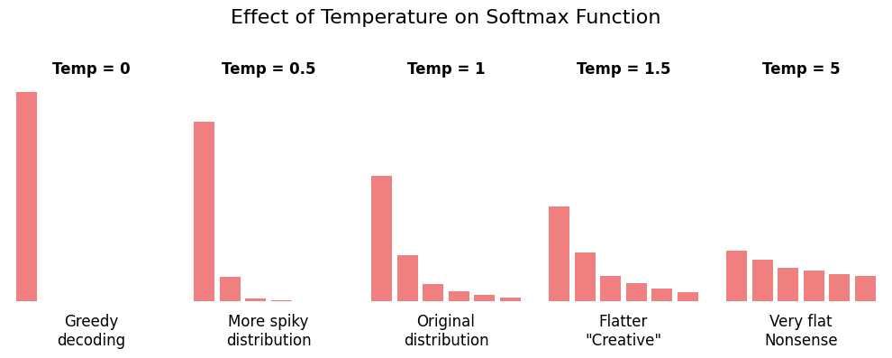
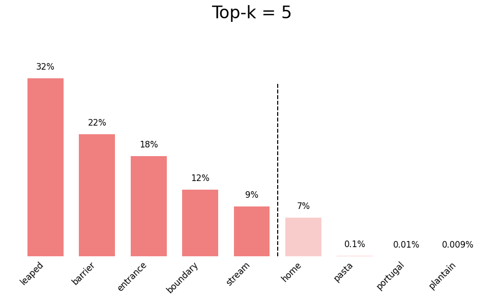

# Demonstrates how GenAI parameters like Temperature, top-K top-P work

The code to generate the images is in [visualize_parameters.ipynb](./visualize_parameters.ipynb)

## Temperature

## Top-K

## Top-P

